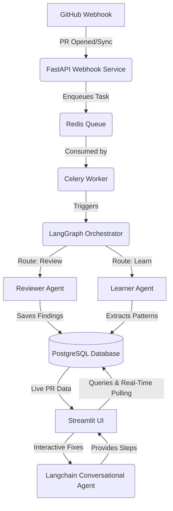

<div align="center">

# 🤖 AI-Powered Code Review Pipeline

**An intelligent, autonomous, multi-agent system for automated GitHub Pull Request reviews and codebase learning.**

[](https://python.org)
[](https://fastapi.tiangolo.com)
[](https://streamlit.io)
[](https://docker.com)
[](https://kubernetes.io)

</div>

<hr>

## 🌟 Project Overview

The **AI-PR-Reviewer** is an advanced DevOps tool designed to integrate directly into your GitHub workflow. Upon receiving a webhook event for a newly opened or updated Pull Request, the system dispatches a multi-agent AI pipeline (orchestrated via **LangGraph**) to analyze code diffs, cross-reference learned coding styles, and generate human-readable feedback.

---

## 🏗️ Architecture



---

## 🚀 Complete Implementation Journey

Below is the detailed chronological roadmap followed to design, build, and deploy this pipeline from scratch, including key code implementations:

### **Phase 1: Foundation & Database Layer**
1. **Repository Initialization:** Set up a monorepo structure with `pyproject.toml`, adopting Hatchling for package management and Ruff for linting.
2. **Database Modeling:** Integrated `SQLAlchemy` with async `asyncpg` drivers. 
```python
# shared/db/models.py
class PullRequest(Base):
    __tablename__ = "pull_requests"
    id = Column(Integer, primary_key=True)
    pr_number = Column(Integer, nullable=False)
    repo_full_name = Column(String, nullable=False)
    status = Column(Enum(PRStatus), default=PRStatus.PENDING)
```

### **Phase 2: Event Ingestion & Task Queue**
3. **FastAPI Webhook Service:** Built a lightweight, highly responsive REST API endpoint.
```python
# services/webhook/main.py
@app.post("/webhook")
async def github_webhook(request: Request, background_tasks: BackgroundTasks):
    payload = await request.json()
    action = payload.get("action")
    if action in ["opened", "synchronize"]:
        # Dispatch Celery background task instantly
        process_pr_task.delay(payload)
    return {"status": "accepted"}
```
4. **Celery Worker Integration:** Configured `Celery` to run asynchronously with a `Redis` message broker.

### **Phase 3: Multi-Agent AI Orchestration (LangGraph)**
5. **State Machine Design:** Defined a strict `TypedDict` state object holding PR context.
```python
# agents/orchestrator/graph.py
class AgentState(TypedDict):
    pr_id: int
    diff_content: str
    findings: List[dict]

workflow = StateGraph(AgentState)
workflow.add_node("reviewer", review_code_node)
workflow.add_node("learner", extract_patterns_node)
```
6. **Reviewer Node:** Built a specialized prompt using `Langchain` and `OpenAI GPT-4o-mini`. 
7. **Database Persistence Node:** A finalizing node to gracefully write the generated `Finding` and `ReviewRecord` entities back into the PostgreSQL schema.

### **Phase 4: Cloud Infrastructure & Deployment**
8. **Containerization:** Wrote highly optimized `Dockerfile`s for microservices.
9. **Kubernetes Manifests:** Designed a robust K8s architecture exposing the Streamlit LoadBalancer.
```yaml
# infra/k8s/chatbot.yml
apiVersion: v1
kind: Service
metadata:
  name: chatbot-svc
spec:
  type: LoadBalancer
  ports:
    - port: 8501
      targetPort: 8501
```

### **Phase 5: User Interface Overhaul (Streamlit)**
10. **Dashboard Tab:** Implemented a live-updating data grid.
```python
# services/chatbot/app.py
from streamlit_autorefresh import st_autorefresh

# Run auto-refresh every 10 seconds
count = st_autorefresh(interval=10000, limit=None, key="pr_autorefresh")
recent_prs = get_recent_prs(active_repo)
st.dataframe(recent_prs)
```
11. **Notifications:** Engineered a stateful tracker (`last_seen_pr_time`) to trigger `st.toast` notifications for new PRs.
12. **Fix Center Tab:** Created an interactive troubleshooting space utilizing the Chatbot LLM.
```python
if st.button("🤖 Generate AI Fix Instructions"):
    prompt = f"Provide a step-by-step guide to fix these findings: {findings_data}"
    response = st.session_state.agent_executor.invoke({"messages": [HumanMessage(content=prompt)]})
    st.markdown(response["messages"][-1].content)
```

---

## 🛠️ Technology Stack

| Category         | Technology / Library |
|------------------|----------------------|
| **Core Language**| Python 3.11+ |
| **Web Framework**| FastAPI, Uvicorn |
| **UI Frontend**  | Streamlit, Pandas |
| **Task Queue**   | Celery, Redis |
| **Database**     | PostgreSQL, SQLAlchemy, asyncpg, Alembic |
| **AI Framework** | LangGraph, Langchain, OpenAI SDK |
| **Deployment**   | Docker, Kubernetes, GitHub Actions |

---

<div align="center">
  <b>Built with ❤️ by an Autonomous AI Agent</b>
</div>
